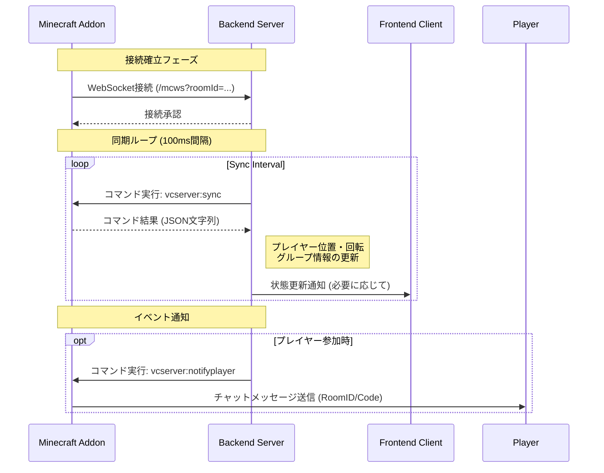

# Minecraft Proximity VC 通信フロー解説

このドキュメントでは、Minecraft Proximity VCにおけるMinecraft Addon（Behavior Pack）とBackendサーバー間の通信フローについて技術的に解説します。

## 1. システム概要

本システムは、Minecraft内のプレイヤーの位置情報や回転情報をリアルタイムにBackendに送信し、それに基づいてボイスチャット（Frontend）の制御を行うことを目的としています。

### コンポーネント構成
- **Addon (BP)**: Minecraft Bedrock Edition上で動作するスクリプト。プレイヤー情報の収集とコマンド実行を担当。
- **Backend**: Node.js/Expressサーバー。WebSocketサーバーとして機能し、AddonとFrontendの中継を行う。
- **Frontend**: ユーザーがブラウザでアクセスするボイスチャットクライアント（本ドキュメントでは詳細割愛）。

## 2. 通信アーキテクチャ

通信は主に**WebSocket**と**Minecraftのコマンドシステム**を利用して行われます。



## 3. 詳細フロー

### 3.1. 接続確立

1.  **WebSocket接続**: Minecraftクライアント（またはサーバー）は、Backendの `/mcws` エンドポイントに対してWebSocket接続を確立します。
    -   URL例: `ws://localhost:3000/mcws?roomId=12345`
    -   `roomId` は必須パラメータであり、このIDに基づいて `RoomHandler` インスタンスが生成・特定されます。

2.  **初期化**: 接続が確立されると、Backendは `RoomHandler.init()` を呼び出し、同期ループを開始します。

### 3.2. データ同期 (Sync Loop)

Backendは `setInterval` を使用して、100msごとに以下の処理を行います。

1.  **コマンド送信**: BackendはWebSocketを通じて、Minecraftに対して `vcserver:sync` コマンドを送信します。
    -   コマンド: `vcserver:sync <getAll: boolean>`
    -   `getAll`: `true` の場合、全データを要求します。`false` の場合、差分更新（最適化）を試みます。

2.  **データ収集 (Addon側)**:
    -   `apps/addon/BP/scripts/src/commands/server-sync.ts` が実行されます。
    -   `SyncManager` がプレイヤーの位置 (`loc`)、回転 (`rot`)、所属グループ情報を収集します。
    -   **最適化**: プレイヤーリスト (`pl`) は、プレイヤーの参加/退出があった場合、または `getAll=true` の場合のみ送信されます。これにより通信量が削減されます。

3.  **データ返却**:
    -   収集されたデータは `SimplifiedSyncData` 形式のオブジェクトになります。
    -   これをJSON文字列化し、さらにBase64エンコードして `SimplifiedSyncMessage` に格納します。
    -   最終的にJSON文字列としてBackendに返却されます。

4.  **状態更新 (Backend側)**:
    -   Backendは受け取ったデータをデコードし、内部の `playerNames` リストや各プレイヤーの状態を更新します。
    -   **プレイヤー管理**:
        -   `pl` フィールドが存在する場合、新規参加プレイヤーの検出 (`handlePlayerJoin`) や退出プレイヤーの検出 (`handlePlayerLeave`) を行います。
        -   `pl` が省略されている場合、プレイヤーリストに変更はないとみなします。

### 3.3. プレイヤー通知

プレイヤーがFrontendから参加し、Minecraft側とリンクする必要がある場合などに使用されます。

1.  **コマンド送信**: Backendは `vcserver:notifyplayer` コマンドを送信します。
    -   引数: `playerName`, `roomId`, `playerCode`
2.  **メッセージ表示**: Addonは指定されたプレイヤーに対して、チャットメッセージで `Room ID` と `Player Code` を通知します。

## 4. データ構造 (Type Definitions)

通信に使用される主要なデータ型は `@minecraft/proximity-vc` パッケージ（`types/index.ts`）で定義されています。

### SimplifiedSyncData

```typescript
export interface SimplifiedSyncData {
    g: SimplifiedGroupData[]; // グループ情報
    pl?: string[];            // プレイヤー名リスト (Optional: 最適化のため)
    pd: number[][][];         // プレイヤーデータ [位置, 回転, グループID]
}
```

-   `pl` をOptionalにすることで、毎フレームのプレイヤー名リスト送信を抑制しています。

### SimplifiedSyncMessage

```typescript
export interface SimplifiedSyncMessage {
    s: number; // シーケンス番号 (パケット順序保証用)
    d: string; // Base64エンコードされた SimplifiedSyncData
}
```

## 5. 通信の安定性と整合性

-   **シーケンス番号 (`s`)**: 各同期パケットにはシーケンス番号が付与されています。Backendはこれを確認し、パケットの欠落や順序の不整合を検知した場合、次回の要求で `getAll=true` を指定して完全同期を強制します（自己修復機能）。
-   **Base64エンコード**: コマンドの戻り値として複雑なJSON構造を安全に返すため、データ本体はBase64エンコードされています。
